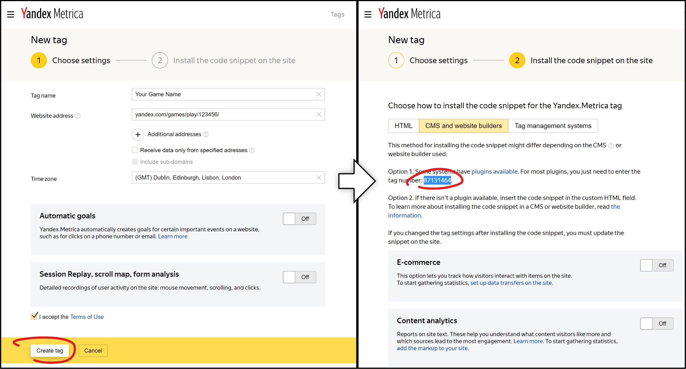

# Yandex.Metrica for Defold

[Yandex.Metrica](https://metrika.yandex.com/) is a free of charge web analytics tool for websites, that's the reason why we can use it for HTML5 games. Yandex.Metrica is one of the top three leading web analytics solutions in the world.

Don't be confused with AppMetrica by Yandex - it's an iOS/Android app analytics.

This native extension doesn't implement all Yandex.Metrica functions, but they are enough to track most of the stats of your game.

## Supported Platforms

| Platform        | Status |
| --------------- | ------ |
| Browser (HTML5) | Supported ✅ |

## Installation & Usage

### 1. Create Yandex.Metrica Tag

You need a Yandex ID in order to work with Yandex.Metrica. If you don't have one, you first need to sign up.

On the page with the list of tags, [add a tag](https://metrica.yandex.com/add). The tag setup page opens. Then fill in the information:

- **Tag name.** The specified name is shown on the My tags page and in the upper menu for switching between tags. Use the name of your Defold game.
- **Site URL.** Put the address of your game on Yandex.Games like `yandex.ru/games/play/123456`.

Then accept the Terms of use, click Create a tag. Copy the ID of your counter.



### 2. Add YaMetrica As Dependency

You can use YaMetrica in your own project by adding this project as a [Defold library dependency](http://www.defold.com/manuals/libraries/).

Open your `game.project` file and in the dependencies field under project add the ZIP file of a [specific release](https://github.com/indiesoftby/defold-yametrica/releases).

Then add the following to your `game.project` file:

```
[yametrica]
counter_id = PUT_YOUR_COUNTER_ID_HERE
```

Setting the `yametrica.counter_id` option initializes Yandex.Metrica SDK in the HTML5 template ([take a look at how it's done](https://github.com/indiesoftby/defold-yametrica/blob/main/yametrica/manifests/web/engine_template.html#L27)). From this moment, you can call `yametrica.*` functions.

### 3. Call YaMetrica Methods

In your `main.script` call `not_bounce` to send information about a non-bounce. It means, for the Yandex.Metrica, that your game finished loading:

```lua
function init(self)
	if yametrica then
		yametrica.not_bounce()
	end
end
```

Then, for every in-game events like scene switching or level ending, call `hit`:

```lua
if yametrica then
    yametrica.hit("#event-name", { title: "Event Name" })
end
```

### Best Practices

Keep in mind that Yandex.Metrica is web analytics for **websites**, but you are going to use it for an HTML5 game, which is, technically, a single-page website.

1. Call `hit(..)` to track significant events in your game: start/end of a level, show/hide of a scene, calling fullscreen ads, etc.
2. Use anchor identifiers as IDs of events and titles as the name of events: `yametrica.hit("#scene-started-introduction", { title: "Scene Started: Introduction" })`.
3. It's crucial to call `hit(..)` quite often to have a precise `Session Length` value.

### Lua <-> JS

| [Yandex.Metrica JS SDK](https://yandex.com/support/metrica/objects/method-reference.html?lang=en) | YaMetrica Lua API |
| --------------------- | ----------------- |
| `ym(XXXXXX, 'hit', url[, options])` | `yametrica.hit(url, [options])` |
| `ym(XXXXXX, 'notBounce', [options])` | `yametrica.not_bounce([options])` |
| `ym(XXXXXX, 'params', visitParams[, goalParams])` | `yametrica.params(visit_params, [goal_params])` |
| `ym(XXXXXX, 'reachGoal', target[, params[, callback[, ctx]]])` | `yametrica.reach_goal(target, [params])` |
| `ym(XXXXXX, 'userParams', parameters)` | `yametrica.user_params(parameters)` |
| <hr> | <hr> |
| `ym(XXXXXX, 'addFileExtension', extensions)` | Not implemented |
| `ym(XXXXXX, 'extLink', url[, options])` | Not implemented |
| `ym(XXXXXX, 'file', url[, options])` | Not implemented |
| `ym(XXXXXX, 'getClientID', function(clientID) { <function body> })` | Not implemented |
| `ym(XXXXXX, 'setUserID', "12345")` | Not implemented |

## Credits

Artsiom Trubchyk ([@aglitchman](https://github.com/aglitchman)) is the current YaMetrica owner within Indiesoft and is responsible for the open source repository.

This project uses the source code of [CJSON](https://github.com/mpx/lua-cjson).

### License

MIT license.
